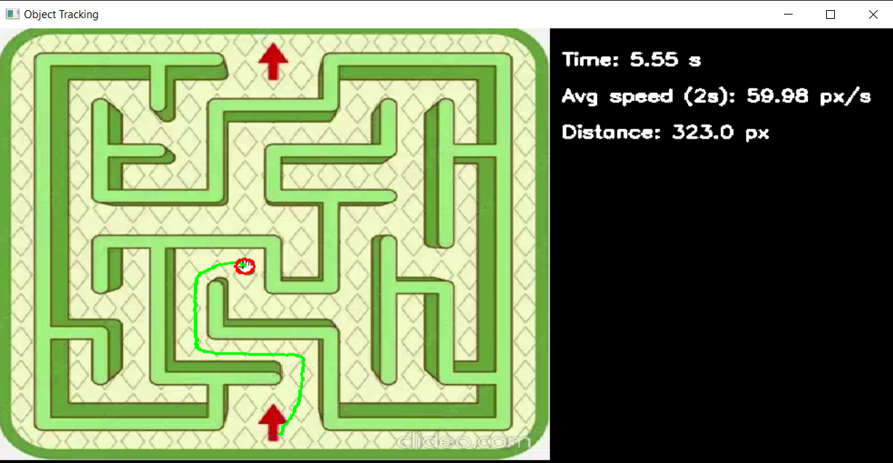

# Проект с профильной смены "Инжевика 2017" - Бегущий в лабиринте (отслеживание движения предмета в лабиринте)

🎥 **Object Motion Tracker** — это Python-программа для отслеживания движения объекта на видео с отображением полной траектории, средней скорости, пройденного расстояния и времени в реальном времени. Программа также выводит сводную информацию в удобной боковой панели.

## 🔍 Возможности

- 📍 Обнаружение движения объекта в кадре
- ✏️ Построение непрерывной траектории движения
- 🕒 Подсчёт общего времени
- 📏 Подсчёт пройденного расстояния (в пикселях)
- 🚀 Отображение средней скорости за последние 2 секунды
- 🧾 Информационная панель сбоку видео
- 🧠 Устойчивость к кратковременной потере объекта

---

## 🖥️ Скриншот интерфейса

  
_Пример интерфейса программы с траекторией и информационной панелью._

Изначально на видео был муравей, который проходил лабиринт, а мы отслеживали его параметры, но тк это было в далёком 2017 году (а я тогда был нулём и ничего не понимал), то я уже забыл как изначально выглядела программа. Но мне захотелось повторить этот проект... 